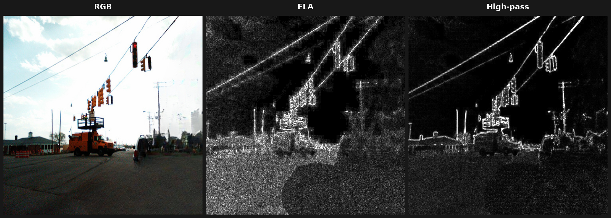
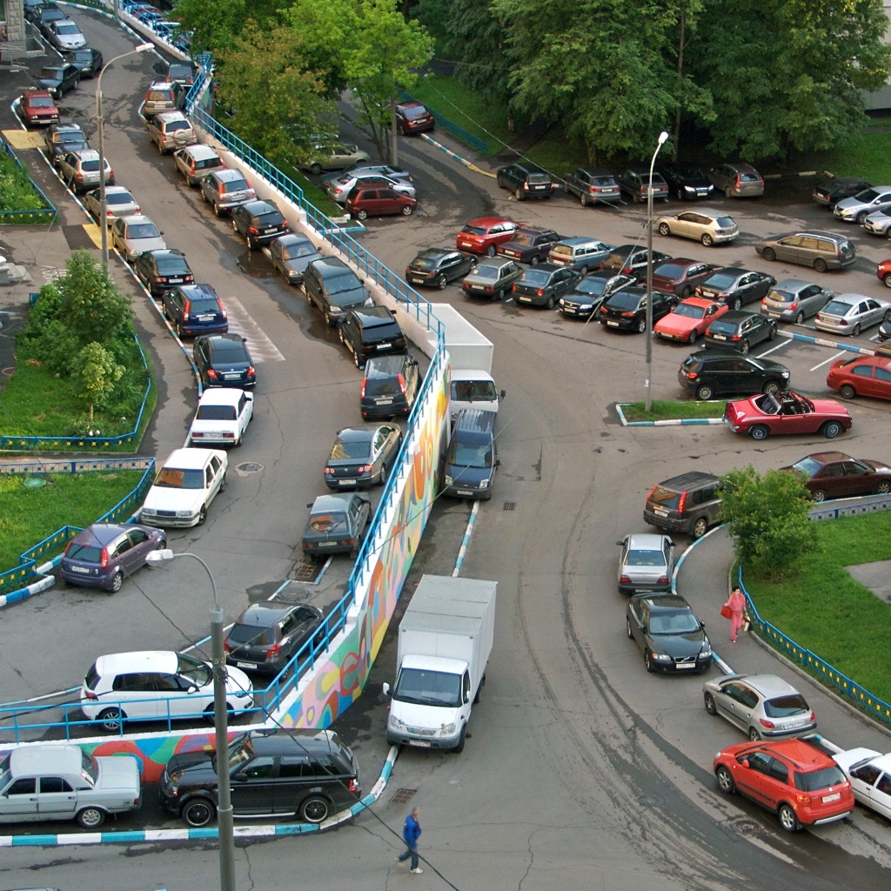
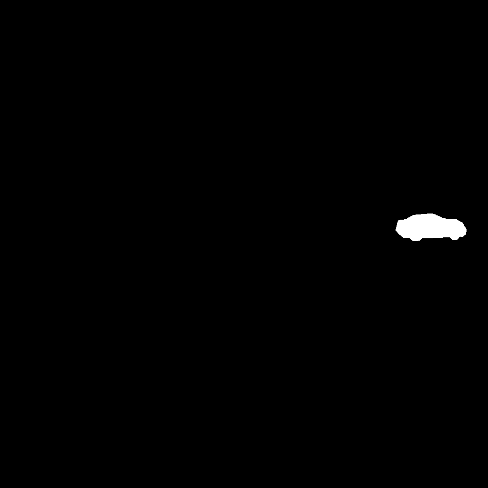
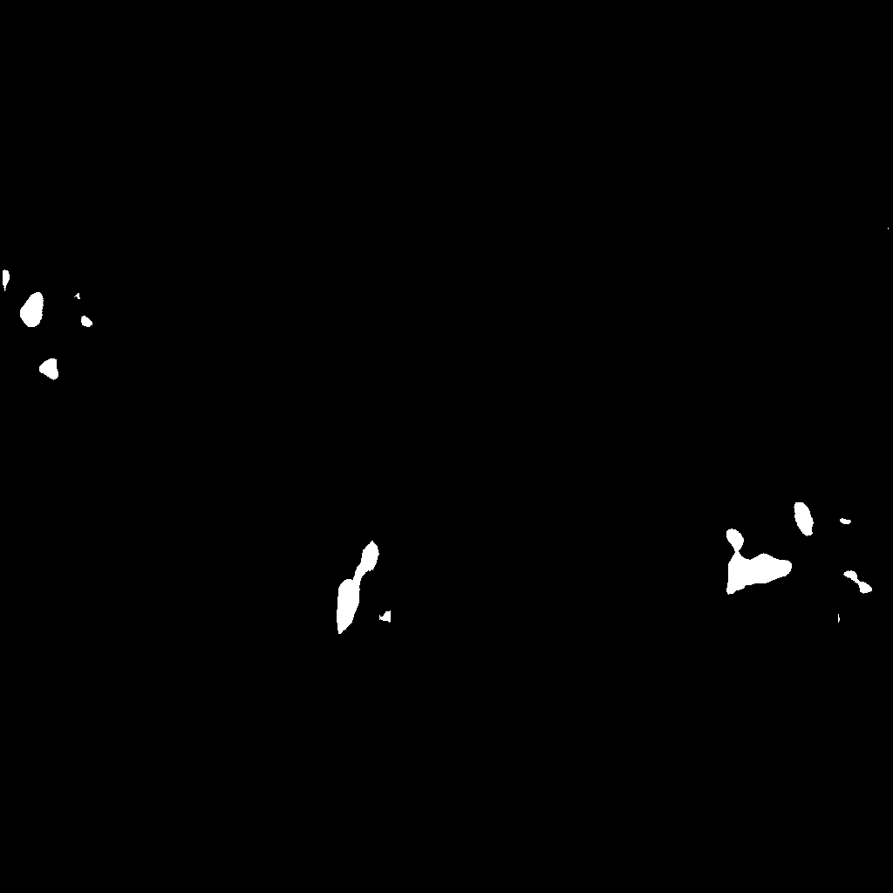
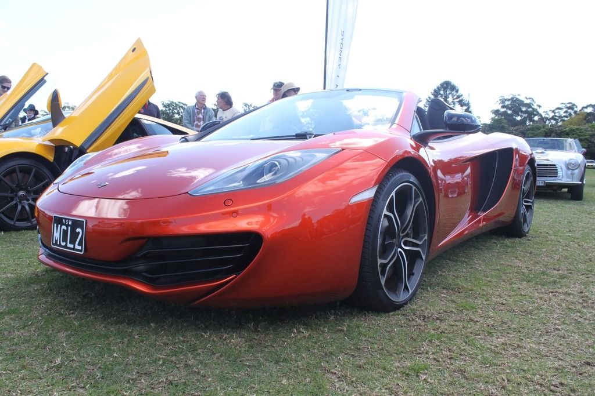
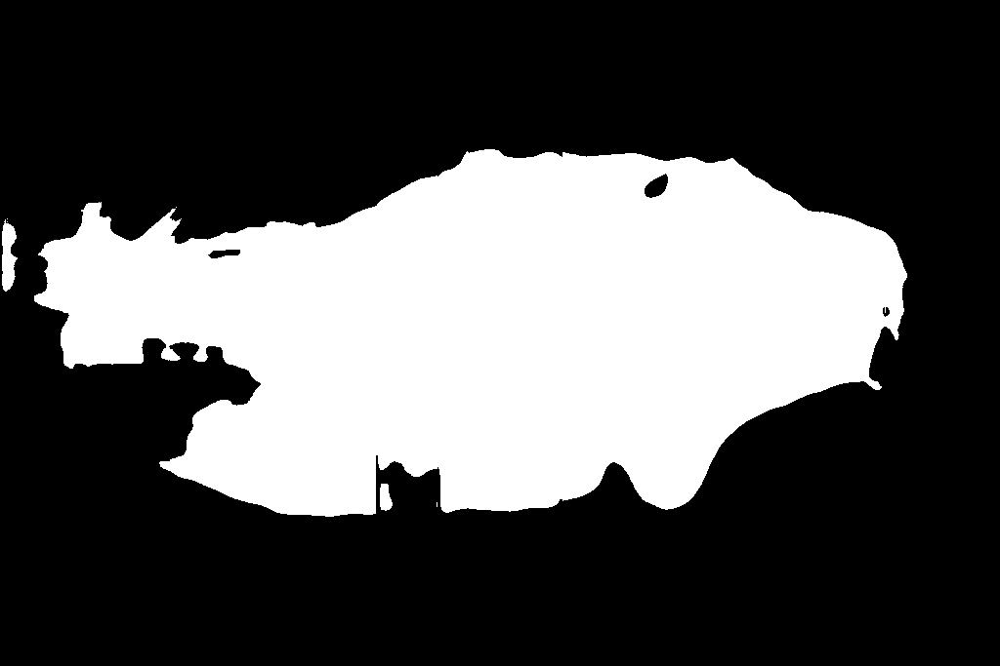
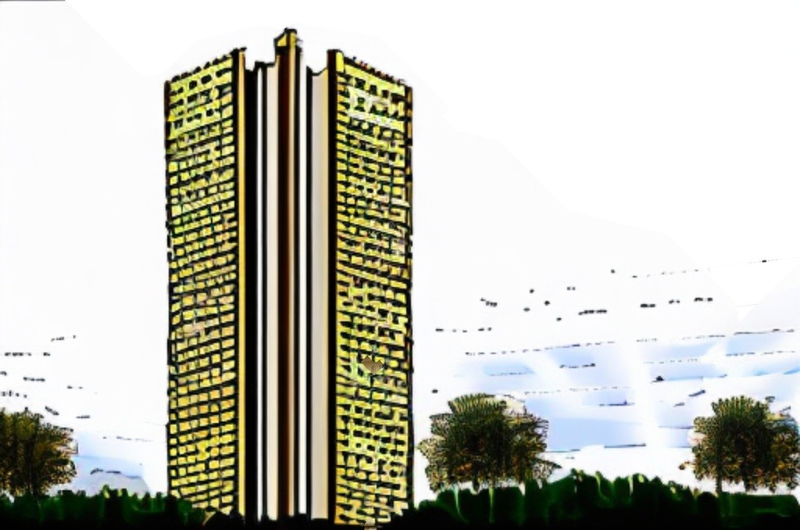
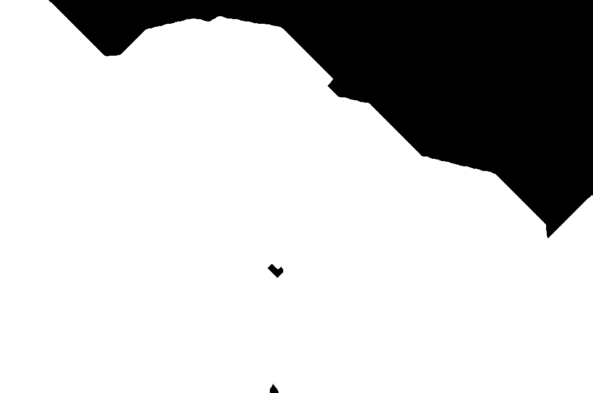
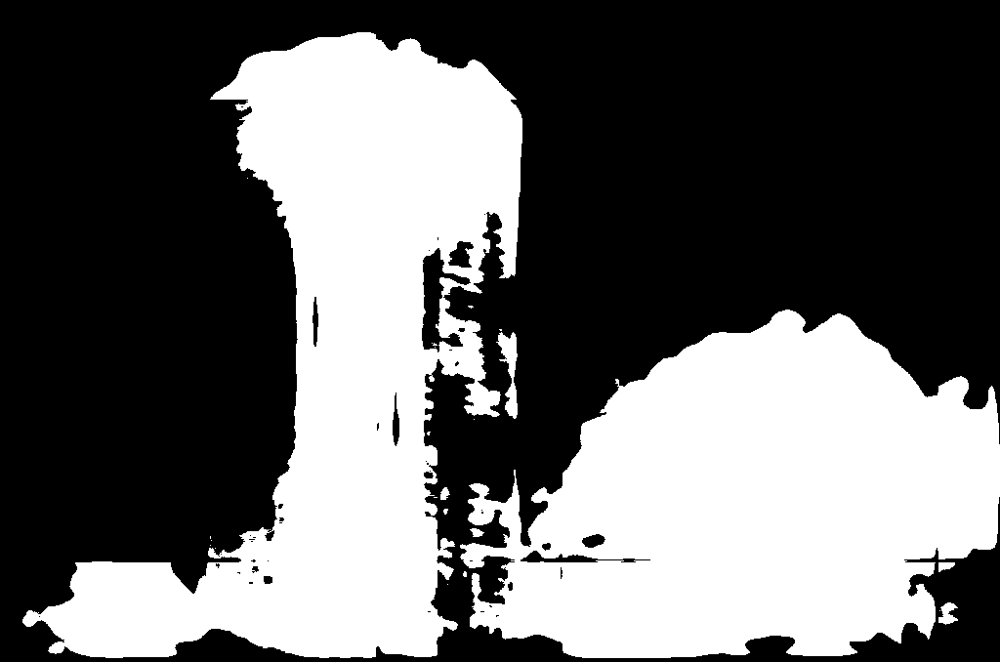

# Forensic Image Segmentation

**Сегментация областей фотоподделок:** по RGB-изображению предсказать бинарную
маску внесённых правок в нативном разрешении и отделить честные фото от изменённых.

**Финальная метрика: 0.891** (`0.5·Dice + 0.5·Clean`), при «голом» бейзлайне ~0.89 —
основной вклад решения ушёл в архитектуру по бизнес-метрике, forensics-каналы и
инференс-слой, а не в сырое качество сегментации.

Ядро проекта — дисциплинированный экспериментальный конвейер: 15+ последовательных
AB-экспериментов, каждый с одной переменной, фиксированной валидацией и записанным
выводом. Полный протокол - в [experiments.md](experiments.md).

> Датасет и метрика — от соревнования AIC Challenge (команда из двух человек).
> Весь пайплайн: AB-конвейер, лоссы, инференс-слой, эксперименты и выводы — авторские.

**TL;DR**
- **Задача:** бинарная сегментация областей фотоподделок (image forensics), precision-leaning.
- **Результат:** 0.891 (`0.5·Dice + 0.5·Clean`); главный вклад — архитектура по метрике, кропы с гарантированным захватом правок, forensics-каналы.
- **Метод:** 15+ AB-экспериментов по одной переменной, бит-в-бит тесты рефакторинга, протокол с якорными цифрами.
- **Стек:** PyTorch, smp (Unet + eff-b3), 5-канальный вход (RGB + ELA + high-pass), bf16-AMP.

## Быстрый старт

```bash
pip install -r requirements.txt

# обучение (смоук на сэмпле):
python train.py --data-dir <path> --epochs 2 --max-rows 1000 --num-workers 8

# полный ран:
python train.py --data-dir <path> --epochs 35 --num-workers 8 --use-crops

# оценка моделей, подбор порогов, генерация предсказаний:
# notebooks/02_eval_and_submit.ipynb
```

Ожидаемая структура данных: `<path>/train.csv` + `<path>/img/` + `<path>/mask/`
+ `<path>/src/` (пары original/manipulated/mask, csv с колонками
orgl_img_path, chng_img_path, gt_path).

## Постановка

Генеративные модели делают реалистичные правки фото доступными каждому:
«нарисованная» царапина на автомобиле для страховой выплаты, испорченное блюдо
для компенсации от доставки, сгенерированный чек, лишний предмет в кадре.
Проект — «цифровой детектив», который находит и локализует такие правки.

- **Вход:** RGB-изображение (нативные разрешения до ~4000×3000).
- **Выход:** бинарная маска правки (нативное разрешение).
- **Ключевое ограничение (precision-leaning):** ложное обвинение честного фото
  (FP) хуже пропуска пикселя подделки (FN) — штраф за FP выше.
- **Метрика:** `0.5·Dice + 0.5·Clean`, где Dice считается только по изменённым
  картинкам, Clean = 1 − доля FP-пикселей на чистых.

## Данные

- 80k троек (original, manipulated, GT-mask): синтетика inpainting моделями
  (lama, powerpaint, sd, brushnet) на базах RAISE/COCO.
- Естественных чистых картинок всего 2.4% → классовый дисбаланс решался
  оригиналами пар: балансировка до 30% чистых в train, все доступные чистые
  в val (иначе метрика чистоты измерялась бы по 2 картинкам из 147).
- В рамках исходного плана предполагался также pseudo-labeling через предоставленный
  инструмент генерации (nanobanana): слабые маски из пар (original, generated) с пониженным весом
  в лоссе. Ветка осознанно отложена. Разбор причин в experiments.md.

## Решение

### Модель

- `segmentation_models_pytorch.Unet` + энкодер `timm-efficientnet-b3` — выбор
  обоснован архитектурным бенчмарком (см. [Результаты](#результаты)).
- Вход — 5 каналов: RGB + ELA + High-pass. Forensics-карты считаются от нативного
  изображения **до** ресайза: ELA завязана на JPEG-сетку оригинала, после
  интерполяции сигнал теряется.
- Aux-голова классификации «изменено/чисто» (GAP → Dropout → Linear) — обучается
  совместно с сегментацией, на инференсе работает как гейт.

### Лосс

0.5 · FocalTversky(α=0.7, β=0.3, γ=0.75) + 0.5 · BCE(seg) + 1.0 · BCE(aux)

- `α > β` кодирует precision-leaning прямо в градиенты: FP штрафуется в 2.3 раза
  сильнее FN.
- Tversky зануляется на полностью чистых картинках — их учит только BCE + aux.
  Это фикс бага, при котором лосс «зависал» на 0.9996 без градиента
  (нулевые производные Tversky при пустой GT-маске).
- Лосс всегда считается в fp32 при bf16-autocast: редукции по 576×576
  переполняют fp16.

### Обучение

- Два режима входа (флаг `--use-crops`):
  - ресайз целой картинки в 576²;
  - случайные нативные кропы 576² с **гарантированным захватом правки** —
    кроп от манипулированной картинки обязан содержать пиксели GT-маски,
    иначе модель учится «чистоте» на правленых сценах.
- Аугментации: только H/V-флипы, синхронно картинка и маска, флип до вычисления
  ELA. Фотометрия, блюр, шум — **запрещены**: они разрушают forensics-сигнал
  (ELA завязана на JPEG-отклик конкретных пикселей).
- AdamW, lr 4e-4, warmup 2 эпохи + косинус; bf16-AMP; чекпоинт по лучшему
  per-image скору.
- Кастомный цикл обучения вместо `smp.utils.train`: per-image агрегация метрик
  вместо смещённой батчевой — иначе селекция чекпоинта зависит от того,
  какие картинки случайно попали в последний батч.

### Инференс

1. **TTA:** 3 прохода (оригинал, H-flip, V-flip), усреднение вероятностей
   до бинаризации.
2. **Слайдинг-виндоу:** окна 576² с overlap 1/3; каждое окно проходит тот же путь,
   что кроп при обучении (forensics от нативного окна, не от целой картинки);
   prob-карты сшиваются усреднением.
3. **Постпроцессинг:** порог → удаление мелких связных компонент → aux-гейт
   (маска зануляется при уверенном «чисто» от классификатора).
4. **Grid search 4 осей** (порог × min_area × reject × gate) по финальной метрике
   на val.

## Визуализации

Forensics-каналы — сигнал, который модель видит помимо RGB. 
Слева направо: оригинал, ELA (правленые области реагируют на пересжатие иначе окружения), high-pass (частотные аномалии):



Предсказания финальной модели (original | GT | predicted):

| | Original | GT mask | Predicted |
|---|---|---|---|
| Точный кейс |  |  |  |
| False positive на чистом фото |  | — (картинка чистая) |  |
| Hard case |  |  |  |

FP на чистом фото — ровно тот сценарий, против которого построен
precision-leaning лосс и aux-гейт: модель должна промолчать, но не всегда может.

## Результаты

### Архитектурный бенчмарк

| Модель | params | GFLOPs | Dice | Clean | Score |
|---|---|---|---|---|---|
| **Unet + eff-b3** | 13.2M | 39.2 | 0.646 | 0.954 | **0.800** |
| DeepLabV3+ + eff-b3 | 11.7M | 30.6 | **0.649** | 0.938 | 0.794 |
| FPN + resnet34 | 23.2M | 70.7 | 0.506 | 0.934 | 0.720 |
| Unet + resnet34 | 24.4M | 80.4 | 0.500 | 0.922 | 0.711 |
| MAnet + resnet34 | 31.8M | 85.6 | — | — | коллапс (NaN loss) |

Ключевое наблюдение: DeepLabV3+ выигрывал по Dice, но проигрывал по Clean —
и вылетел. Выбор архитектуры определила бизнес-метрика, а не голое качество
сегментации.

### Основной цикл AB-экспериментов

Фиксированный val (сэмпл 1000, seed 42), одна переменная за прогон:

| # | Эксперимент | Score | Вывод |
|---|---|---|---|
| 1 | Sanity-прогон (стартовый цикл) | 0.6754 | механика; найдены BOM-баг парсинга csv, нехватка чистых в val |
| 2 | Свой цикл, лосс по спецификации, aux в контуре, AMP | 0.7215 | aux 0.48 → 0.80 accuracy |
| 3 | + forensics-каналы (ELA/HP) | 0.7131 | Dice нейтрален, aux 0.86: каналы — image-level сигнал |
| 4 | Трансформер mit_b1 (A/B энкодера) | 0.6052 | холодный старт на малых данных, ветка закрыта |
| 5 | Aux-гейт на инференсе | +0.0006 | FP на чистых живут при aux > 0.5 — постпроцессингом не лечится |
| 6 | Аугментации (H/V-флипы) | 0.7197 | разрыв train-val сжался, val loss ниже |
| 7 | Ансамбль трёх собственных моделей | 0.7256 | работает при сопоставимой силе компонентов |
| 8 | Нативные кропы + слайдинг-виндоу | **0.7374** | разрешение — главный прирост Dice на val |

Полный протокол всех прогонов, включая промежуточные и диагностические —
в [experiments.md](experiments.md).

### Финальная оценка

| Конфигурация | Score |
|---|---|
| 80k, соло: кропы + слайдинг-виндоу + гейт | **0.89092** |
| Ансамбль 80k + 20k | 0.89099 |
| Ресайз-инференс (без окон) | 0.8888 |
| Бейзлайн без инференс-стека | ~0.89 |

## Выводы по проекту

- **Первый сабмит — в первый день.** Внешняя оценка — единственный детектор доменного сдвига: наш val оказался контаминирован
  (~90% его строк входило в трейн полного рана) и принадлежал тому же синтетическому домену, что и обучение.
  Выяснилось, что это только на финальной оценке все решения о порогах принимались по смещённому прокси.
- **Ансамбль = разнообразие, а не число моделей.** Ансамбль трёх собственных
  моделей (#7) дал прирост только потому, что компоненты были сопоставимы по
  силе — просто сложить разнокачественные чекпоинты не работает.
- **Техника vs цель.** Эксперимент с трансформерным энкодером mit_b1 —
  технически интересная ветка, но холодный старт на малых данных не окупался;
  ветку закрыли, не пытаясь спасти интересную идею ради самой идеи.
- **Метрика определяет архитектуру, а не наоборот.** DeepLabV3+ выигрывал поDice, но терял на Clean и проиграл
  по итоговому скору (0.794 против 0.800), поэтому выбор пал на Unet+eff-b3 по бизнес-метрике, а
  не по более качественной сегментации.
- **Малый val — лотерея.** При фиксированном сэмпле 1000 и естественной доле
  чистых картинок 2.4% val легко мог не набрать статистики по Clean — отсюда
  жёсткая балансировка чистых в val и дисциплина «одна переменная за прогон»
  с фиксированным seed, чтобы не путать шум с сигналом.
- **Инженерная гигиена не менее важна, чем архитектура.** Баг с обнулением
  градиента Tversky на чистых масках, fp32-редукция под bf16-autocast и
  per-image (а не батчевая) агрегация метрик при селекции чекпоинта — три
  тихих бага, каждый из которых мог незаметно испортить итоговый скор.

## Команда и роли

Проект выполнен в команде из двух человек с разделением по компетенциям: экспериментальная ветка 
(этот репозиторий: AB-конвейер, лоссы, инференс-слой, аналитика всех прогонов) и 
марафонная ветка (полные обучающие раны на 20k/80k, подготовка данных). Общий код — src/ и train.py.

## Структура репозитория

```
.
├── README.md
├── experiments.md
├── requirements.txt
├── train.py
├── src/
│   ├── data.py          # датасеты (resize/crop), аугментации, сборка val
│   ├── forensics.py     # ELA + High-pass
│   ├── loop.py          # цикл обучения, CombinedLoss, AMP
│   ├── threshold.py     # постпроцессинг + grid search 4 осей
│   └── paths.py
├── notebooks/
│   ├── 01_ab_experiments.ipynb
│   └── 02_eval_and_submit.ipynb
└── assets/
    ├── forensics_ela_example.png
    └── predictions/
```
